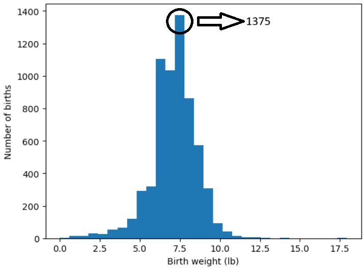

# EXPLORATORY-DATA-ANALYSIS-IN-PYTHON
Dataframes and Series

## How much did (BABY'S NAME/this 1st baby) weigh at birth? (Pounds) - First Exercise 
Notebook: [First Exercise](Exploratory_Analysis_FirstExercise.ipynb)

So, What do we can see in the previous graph?

* Birth weights falling between 5.979 and 6.577 have a count of 1104.
* Birth weights in the range of 6.577 to 7.175 are represented by 1033 occurrences.
* The highest count, 1375, is observed for birth weights within the range of 7.175 to 7.773.

## Sales Optimization Case Study - Second Exercise

You work as a data analyst for ABC, an online retailer that offers everything from fashion to electronics. For the last six months, the company's sales have been declining, and the management is worried about the viability of the enterprise going forward. The management wants to understand the underlying factors contributing to the decline in sales. They are particularly interested in:

 1. Identifying the categories of products that are performing well or poorly.
 2. Understanding customer behavior, including spending patterns and frequency of purchases.
 3. Evaluating the effectiveness of various sales channels. Your task is to conduct an exploratory data analysis to uncover insights that
 can help the company reverse the declining sales trend. 
 
 ### Time Series Analysis
 1. The sales at ABC have been like a rollercoaster, going up and down every month. Can you chart this fluctuating journey and identify any seasonal patterns that might explain these ups and downs?
 2. It's a busy week at ABC, but is every day equally busy? Your task is to find out if weekdays bring in more sales than weekends or vice versa. This could help the company in planning their staffing and marketing strategies.

 ### Customer Segmentation
 1. ABC wants to roll out a VIP program but isn't sure who to invite. Your task is to identify the top 10% of customers based on their spending. What makes these customers special?
 2. Customer retention is a big deal at ABC. The company wants to reward customers who come back to make multiple purchases. Can you identify these loyal customers and find out what keeps them coming back?
 
 ### Product Analysis
 1. In the vast inventory of ABC, some products are stars while others are not. Can you spotlight the top 5 best-selling products in each category and suggest why they might be the customer favorites?
 2. Returns are a headache for any retail business. ABC is no exception. Your challenge is to identify products that are frequently returned and hypothesize why this might be happening.

 ### Payment and Returns
 1. People have different preferences when it comes to parting with their money. Can you find out if there's a preferred payment method for higher-value orders? This could influence future payment options offered by ABC.
 2. Returns are like a leak in a boat, and ABC wants to plug it. Are there specific categories or payment methods that are more prone to returns? Your findings could help the company tighten its return policy.